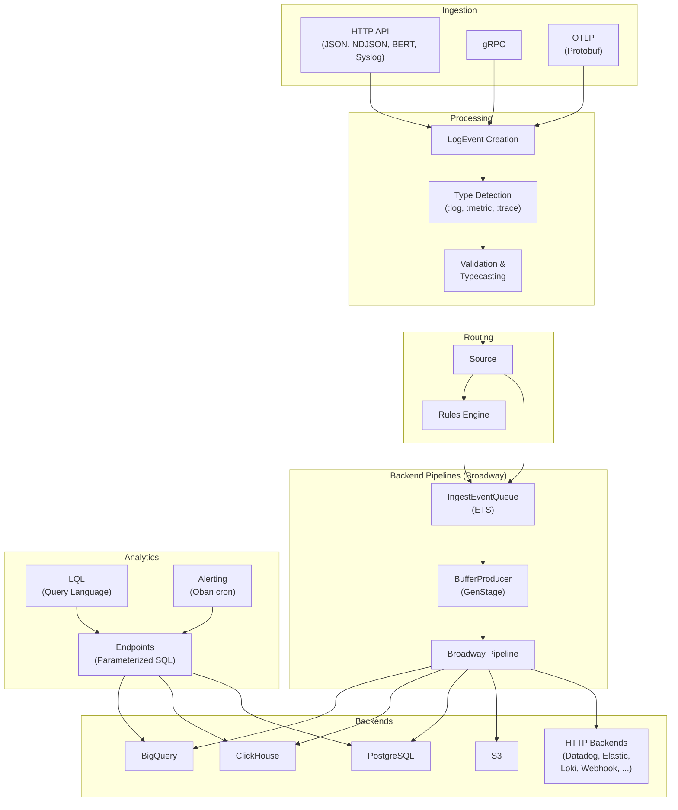
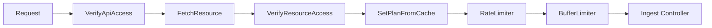
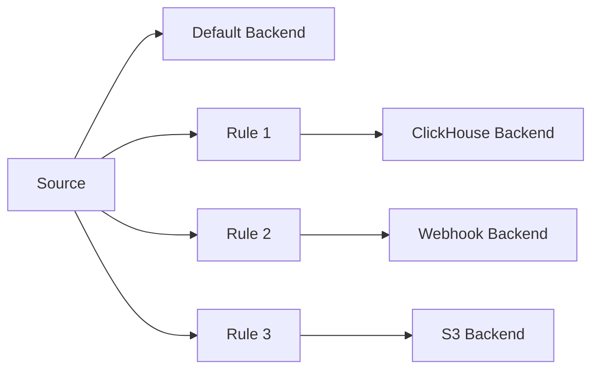
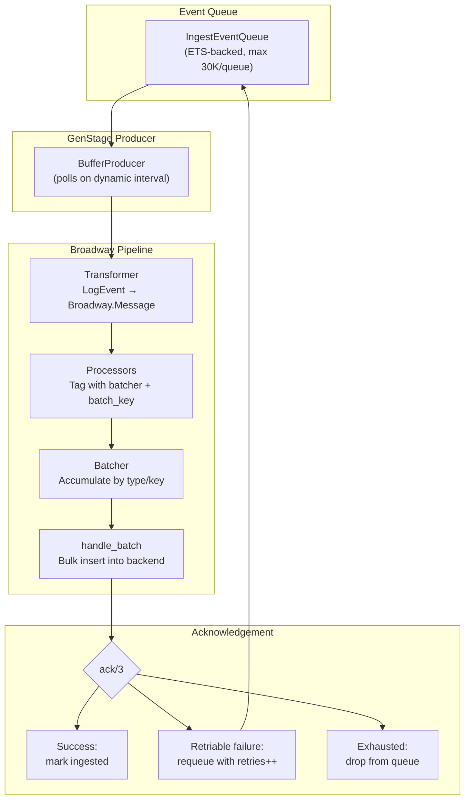
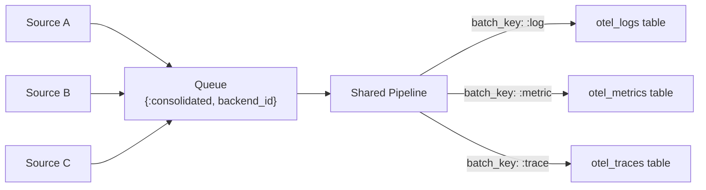
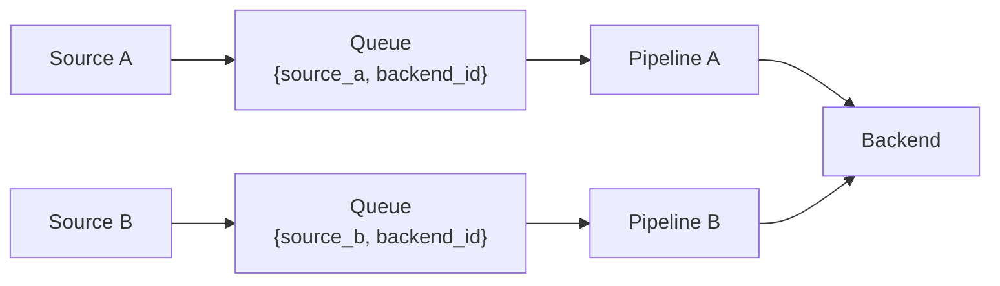
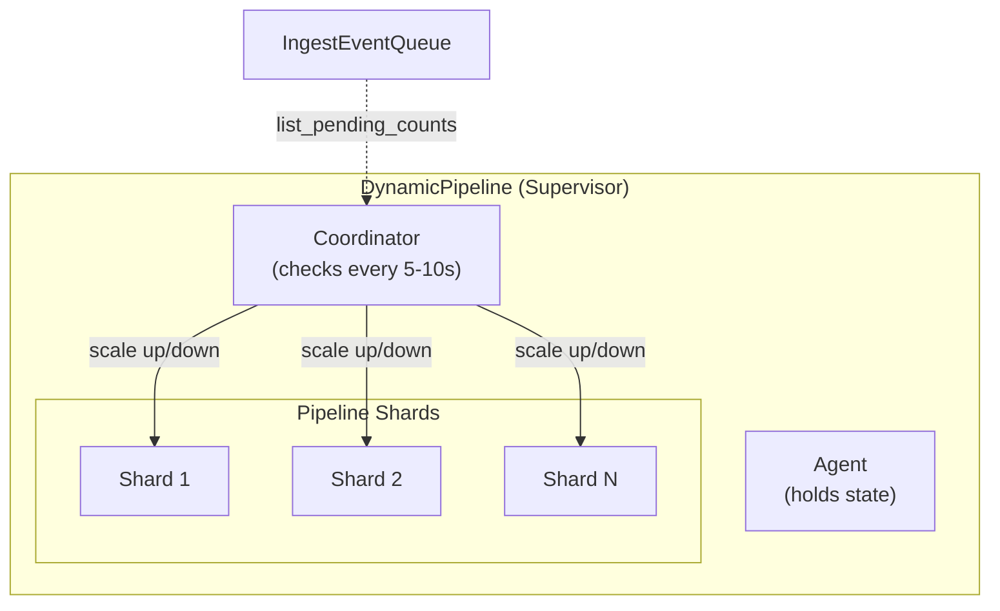
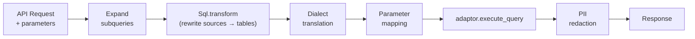
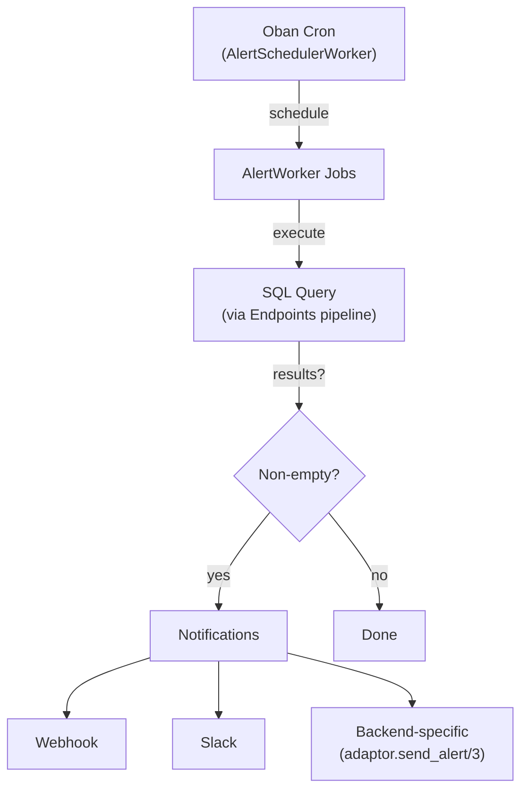

# Logflare Architecture

Logflare is a real-time log aggregation and analytics platform built with [Elixir](https://elixir-lang.org/)/[Phoenix](https://www.phoenixframework.org/). It ingests structured log events via HTTP, gRPC, and OpenTelemetry protocols, routes them through configurable pipelines, and stores them in pluggable backend databases. It supports both multi-tenant SaaS and single-tenant deployment modes.

## Table of Contents

- [System Overview](#system-overview)
- [Ingestion Layer](#ingestion-layer)
- [Log Event Processing](#log-event-processing)
- [Backend System](#backend-system)
- [Broadway Pipelines](#broadway-pipelines)
- [Dynamic Pipeline Scaling](#dynamic-pipeline-scaling)
- [Supervision Tree](#supervision-tree)
- [Query and Analytics Layer](#query-and-analytics-layer)
- [Alerting](#alerting)
- [Caching](#caching)
- [Rust NIFs](#rust-nifs)
- [Web Layer](#web-layer)
- [Deployment Modes](#deployment-modes)
- [Key Dependencies](#key-dependencies)

---

## System Overview



---

## Ingestion Layer

Logflare accepts log events through three protocol families, all funneling into the same internal `LogEvent` pipeline.

### HTTP API

The primary ingestion path. The Phoenix router defines an `:api` pipeline with parsers for multiple formats:

- **JSON** / **NDJSON** — standard structured log payloads
- **BERT** — Binary Erlang Term format for Erlang/Elixir clients
- **Syslog** — RFC 5424 syslog messages
- **Protobuf** — OpenTelemetry collector exports (traces, metrics, logs)

Ingestion requests pass through a plug pipeline that handles auth, rate limiting, and buffer limiting:



Rate limiting is per-source and plan-aware. Buffer limiting prevents queue overflow by rejecting requests when the `IngestEventQueue` is full.

### gRPC

A [gRPC](https://grpc.io/) endpoint runs alongside the HTTP server for high-throughput ingestion from clients that benefit from HTTP/2 streaming and binary serialization.

### OpenTelemetry (OTLP)

Dedicated OTLP endpoints accept [OpenTelemetry](https://opentelemetry.io/) protobuf payloads:

- `ExportTraceServiceRequest` — distributed traces
- `ExportMetricsServiceRequest` — metrics
- `ExportLogsServiceRequest` — logs

These are decoded and converted into `LogEvent` structs via modules in `lib/logflare/logs/` (`otel_log.ex`, `otel_metric.ex`, `otel_trace.ex`).

---

## Log Event Processing

The `Logflare.LogEvent` struct is the core data unit flowing through the system.

### Key Fields

| Field | Type | Description |
|-------|------|-------------|
| `id` | `binary_id` | UUID |
| `body` | `map` | Event payload (user data) |
| `event_type` | `:log \| :metric \| :trace` | Classified type |
| `ingested_at` | `utc_datetime_usec` | Server ingestion time |
| `source_uuid` | `Ecto.UUID` | Immutable source reference |
| `via_rule_id` | `id` | Rule that routed this event |
| `retries` | `integer` | Retry counter for failed inserts |
| `pipeline_error` | `embedded_schema` | Error tracking (stage, type, message) |

### Creation Pipeline

`LogEvent.make/2` runs through these stages for each incoming event:

1. **Mapping** — apply data transformations from source config
2. **Validation** — structural and content validation
3. **Transformation** — field enrichment (copy fields, KV enrichment)
4. **Type Detection** — classify as `:log`, `:metric`, or `:trace`

### Type Detection

`Logflare.Logs.LogEvent.TypeDetection` classifies events using a two-pass strategy:

1. **Explicit metadata** — if `metadata.type` is set (e.g., by OTEL processors), use it directly
2. **Heuristic detection** — inspect body keys:
   - **Trace**: has `trace_id` AND `span_id` AND (`parent_span_id` OR `start_time` OR `duration`)
   - **Metric**: has `metric_type`/`metric` AND `value`/`gauge`/`count`/`sum`
   - **Log**: default fallback

The event type determines routing in backend adaptors (e.g., ClickHouse routes to type-specific OTEL tables).

---

## Backend System

Backends are pluggable storage destinations implemented as adaptors. The `Logflare.Backends.Adaptor` behaviour defines the interface.

### Adaptor Behaviour

**Required callbacks:**

| Callback | Purpose |
|----------|---------|
| `start_link/1` | Start the adaptor process |
| `cast_config/1` | Typecast configuration params |
| `validate_config/1` | Validate config via `Ecto.Changeset` |

**Optional callbacks (query execution):**

| Callback | Purpose |
|----------|---------|
| `execute_query/3` | Run queries against the backend |
| `transform_query/3` | Translate queries between SQL dialects |
| `ecto_to_sql/2` | Convert Ecto queries to backend-native SQL |
| `map_query_parameters/4` | Map parameters across dialects (e.g., BigQuery `@param` to PostgreSQL `$1`) |

**Optional callbacks (ingestion):**

| Callback | Purpose |
|----------|---------|
| `format_batch/1` | Transform batch before sending |
| `pre_ingest/3` | Preprocessing before queueing |
| `consolidated_ingest?/0` | Single pipeline per backend (all sources share batch) |
| `test_connection/1` | Connectivity check |
| `send_alert/3` | Send alert notifications |

### Available Adaptors

| Adaptor | Type | Protocol | Notes |
|---------|------|----------|-------|
| **BigQuery** | Database | gRPC (Storage Write API) | Arrow IPC serialization via Rust NIF |
| **ClickHouse** | Database | Native TCP / HTTP | LZ4 compression via Rust NIF; consolidated ingestion |
| **PostgreSQL** | Database | PostgreSQL wire protocol | Via [Postgrex](https://hexdocs.pm/postgrex/) |
| **Elasticsearch** | Search engine | HTTP | |
| **Datadog** | SaaS | HTTP | |
| **Loki** | Log store | HTTP | [Grafana Loki](https://grafana.com/oss/loki/) push API |
| **S3** | Object storage | HTTP | Byte-based batch splitting |
| **Axiom** | SaaS | HTTP | |
| **Webhook** | HTTP | HTTP | Generic outbound webhook |
| **Slack** | Messaging | HTTP | Slack incoming webhooks |
| **Sentry** | Error tracking | HTTP | |
| **Incident.io** | Incident management | HTTP | |
| **Last9** | Observability | HTTP | |
| **Syslog** | Protocol | TCP/UDP | RFC 5424 |
| **OTLP** | Protocol | HTTP/gRPC | OpenTelemetry export |

HTTP-based adaptors share a common pipeline implementation (`lib/logflare/backends/adaptor/http_based/pipeline.ex`).

### Routing via Rules

The `Logflare.Rules` engine routes log events from a source to additional backends based on configurable criteria. Each rule associates a source with a backend — when an event matches, it's copied to the rule's destination backend.



---

## Broadway Pipelines

[Broadway](https://hexdocs.pm/broadway/) is the core of the log ingestion pipeline, providing batching, back-pressure, and fault tolerance between the event queue and backend storage.

### Pipeline Implementations

| Pipeline | Adaptor | Batch Size | Processors | Batchers | Pattern |
|----------|---------|-----------|------------|----------|---------|
| `ClickHouseAdaptor.Pipeline` | ClickHouse | 50,000 | 4 | 2 | Consolidated |
| `HttpBased.Pipeline` | Datadog, Elastic, Webhook, etc. | 250 | 3 | 6 | Per-source |
| `PostgresAdaptor.Pipeline` | PostgreSQL | 350 | 5 | 5 | Per-source |
| `S3Adaptor.Pipeline` | S3 | Byte-based | 5 | 1 | Per-source |

### Data Flow Through Broadway



### IngestEventQueue

`Logflare.Backends.IngestEventQueue` is a GenServer managing ETS-backed buffers that sit between ingestion and Broadway:

- **ETS mapping table** — fan-out pattern directing events to per-queue tables
- **Per-queue tables** — one per `{source_id, backend_id, pid}` or `{:consolidated, backend_id, pid}`
- **Max queue size** — 30,000 events per queue
- **Event status tracking** — `:pending` | `:ingested`
- **Startup queues** — events land in a queue keyed with `nil` PID until a producer registers, then get moved to the active queue

### BufferProducer

`BufferProducer` is a [GenStage](https://hexdocs.pm/gen_stage/) producer bridging `IngestEventQueue` to Broadway:

- **Dynamic polling interval** — adjusts based on source ingestion metrics (up to 5x slower for low throughput)
- **Two fetch modes:**
  - `pop_pending` — consolidated mode, atomically removes events from queue
  - `take_pending` — standard mode, leaves events in place until acked

### Two Ingestion Patterns

#### Consolidated Ingestion (ClickHouse)

All sources sharing a backend funnel through a **single pipeline**. Events are partitioned by `event_type` (`:log`, `:metric`, `:trace`) via `Broadway.Message.put_batch_key/2`, routing to type-specific OTEL tables.



Advantages: larger batch sizes (50K), fewer pipelines, better ClickHouse throughput via fewer larger inserts.

#### Per-Source Ingestion (PostgreSQL, HTTP, S3)

Each source-backend pair gets its **own pipeline**, providing source-level isolation.



### Message Lifecycle

A typical Broadway message flows through:

1. **`transform/2`** — wraps `LogEvent` in a `Broadway.Message` with an acknowledger
2. **`handle_message/3`** — tags with batcher (e.g., `:ch`) and batch key (e.g., event type)
3. **`handle_batch/4`** — performs the bulk insert (mapping, serialization, network call)
4. **`ack/3`** — on failure, splits messages into retriable (retries < max → requeue) and exhausted (drop)

---

## Dynamic Pipeline Scaling

`Logflare.Backends.DynamicPipeline` dynamically scales Broadway pipeline **shards** based on queue depth.



The `Coordinator` periodically calls a `resolve_count` function that inspects `IngestEventQueue.list_pending_counts/1`. If queue depth exceeds thresholds, shards are added (up to `System.schedulers_online()`). If idle, shards are removed. Rate limiting prevents thrashing.

Currently used by the ClickHouse consolidated pipeline.

---

## Supervision Tree

```mermaid
flowchart TB
    App["Logflare.Application"]

    subgraph "Core Infrastructure"
        Repo["Repo"]
        Vault["Vault"]
        PubSub["Phoenix.PubSub"]
        Oban["Oban"]
        Cache["ContextCache.Supervisor"]
    end

    subgraph "Metrics & Tracking"
        Counters["Counters (ETS)"]
        Rate["RateCounters (ETS)"]
        PSR["PubSubRates"]
        SysMet["SystemMetricsSup"]
        AUT["ActiveUserTracker"]
    end

    subgraph "Backend Supervisor"
        IEQ["IngestEventQueue"]

        subgraph "ConsolidatedSup"
            DS1["DynamicSupervisor"]
            CSW["ConsolidatedSupWorker"]
            DP["DynamicPipeline<br/>(per backend)"]
            DS1 --> DP
        end

        subgraph "PartitionSupervisor (SourcesSup)"
            SS1["SourceSup (Source A)"]
            SS2["SourceSup (Source B)"]
            SSN["SourceSup (Source N)"]
        end
    end

    subgraph "SourceSup Detail"
        RCS["RateCounterServer"]
        RIC["RecentInsertsCacher"]
        ENS["EmailNotificationServer"]
        SSW["SourceSupWorker"]
        AS["AdaptorSupervisor"]
        QJ["QueueJanitor"]
        Pipeline["Pipeline (Broadway)"]
        AS --> QJ
        AS --> Pipeline
    end

    subgraph "Web"
        Endpoint["Phoenix Endpoint"]
        GRPC["gRPC Server"]
    end

    App --> Repo
    App --> Vault
    App --> PubSub
    App --> Oban
    App --> Cache
    App --> Counters
    App --> Rate
    App --> PSR
    App --> IEQ
    App --> ConsolidatedSup
    App --> PartitionSupervisor
    App --> Endpoint
    App --> GRPC
    App --> SysMet
    App --> AUT

    SS1 --> RCS
    SS1 --> RIC
    SS1 --> ENS
    SS1 --> SSW
    SS1 --> AS
```



Key ordering constraints:
- **Repo + Vault** must start before anything touching the database
- **Backends** must start before `Source.Supervisor` (backends register queues that sources write to)
- **Counters** must start before `Source.Supervisor` (sources call counters during init)

---

## Query and Analytics Layer

### Endpoints

`Logflare.Endpoints` provides parameterized SQL query endpoints for analytics. Each endpoint defines a SQL query template with named parameters that can be executed on demand.

**Query execution pipeline:**



Endpoints support:
- **Three SQL dialects:** BigQuery SQL, ClickHouse SQL, PostgreSQL SQL
- **Subquery expansion** — references to other endpoints or alerts are inlined as CTEs
- **Sandboxed queries** — endpoints can accept runtime LQL/SQL parameters, constrained to declared CTEs
- **Result caching** — configurable TTL via `ResultsCache`
- **Labels** — extracted from config, headers, and query params for downstream filtering

### LQL (Logflare Query Language)

LQL is a backend-agnostic query DSL parsed via [NimbleParsec](https://hexdocs.pm/nimble_parsec/). It compiles to dialect-specific SQL for each backend.

| LQL Dialect | Target Backend |
|-------------|---------------|
| `:bigquery` | BigQuery SQL |
| `:clickhouse` | ClickHouse SQL |
| `:postgres` | PostgreSQL SQL |

Core operations:
- `decode/2` — parse LQL string into rule structs (`FilterRule`, `SelectRule`, `FromRule`)
- `encode/1` — serialize rules back to LQL string
- `apply_rules/3` — apply rules to an `Ecto.Query`
- `to_sandboxed_sql/3` — compile to SQL for sandboxed endpoint execution

### SQL Parsing and Transformation

SQL parsing is handled by a Rust NIF (`sqlparser_ex`) wrapping the [`sqlparser`](https://crates.io/crates/sqlparser) crate. The Elixir interface in `Logflare.Sql` provides:

- **`transform/3`** — rewrite source names to physical table names, apply schema prefixes
- **`expand_subqueries/2`** — inline endpoint/alert references as CTEs
- **Dialect translation** — convert between BigQuery, ClickHouse, and PostgreSQL SQL variants

---

## Alerting

The alerting system executes SQL queries on a cron schedule and sends notifications when results are non-empty.



Alerts are managed via [Oban](https://hexdocs.pm/oban/) job queues:
- `schedule_alert/1` parses the cron expression, generates the next 5 run dates, and inserts Oban jobs
- `trigger_alert_now/1` allows immediate manual execution
- Execution history (last 50 runs) and future jobs are queryable

---

## Caching

`Logflare.ContextCache` is a read-through caching layer built on [Cachex](https://hexdocs.pm/cachex/) that reduces database load for hot paths.

**Design:**
- One cache per context module (e.g., `Logflare.Users.Cache`, `Logflare.Sources.Cache`)
- Results wrapped in `{:cached, value}` tuples to distinguish cached `nil` from cache miss
- Cache busting via WAL-based invalidation — matches on struct `:id` fields across three patterns (single structs, lists of structs, `{:ok, struct}` tuples)
- Optional `bust_by/1` callback for custom invalidation keys

---

## Rust NIFs

Four Rust [NIFs](https://www.erlang.org/doc/tutorial/nif.html) (Native Implemented Functions) built with [Rustler](https://github.com/rusterlium/rustler) offload CPU-intensive operations to avoid blocking the BEAM scheduler.

| NIF | Crate/Library | Purpose | Used By |
|-----|--------------|---------|---------|
| `sqlparser_ex` | [`sqlparser`](https://crates.io/crates/sqlparser) | SQL parsing and AST manipulation | `Logflare.Sql.Parser` — query transformation, validation, dialect translation |
| `mapper_ex` | Custom | Config-driven data mapping | `Logflare.Mapper` — transforms log event bodies before ClickHouse insertion; config compiled once, reused per-event |
| `arrowipc_ex` | [`arrow`](https://crates.io/crates/arrow) | Arrow IPC serialization | `BigQueryAdaptor.ArrowIPC` — serializes dataframes for BigQuery [Storage Write API](https://cloud.google.com/bigquery/docs/write-api) (8MB chunk splitting) |
| `ch_compression_ex` | [`lz4`](https://crates.io/crates/lz4), [`cityhash-rs`](https://crates.io/crates/cityhash-rs) | LZ4 compression + CityHash checksums | `ClickHouseAdaptor.NativeIngester.Compression` — ClickHouse [native protocol](https://clickhouse.com/docs/en/native-protocol/basics) compression envelope |

### Call Chains

**SQL Parsing:**
```
Logflare.Sql.Parser.Native (NIF) → Logflare.Sql.Parser → Logflare.Sql
  → Endpoints, Alerting, Rules validation, Dialect translation
```

**Data Mapping (ClickHouse only):**
```
Logflare.Mapper.Native (NIF) → Logflare.Mapper
  → MappingConfigStore (compile once, cache) → ClickHouse Pipeline (map per-event)
```

**Arrow Serialization (BigQuery only):**
```
ArrowIPC Native (NIF) → BigQueryAdaptor.ArrowIPC → GoogleApiClient.append_rows
  → gRPC → BigQuery Storage Write API
```

**ClickHouse Compression:**
```
ChCompression (NIF) → Compression → Connection → NativeIngester
  → ClickHouseAdaptor (native TCP inserts)
```

---

## Web Layer

The web layer uses [Phoenix](https://www.phoenixframework.org/) with [LiveView](https://hexdocs.pm/phoenix_live_view/) for real-time UI and a REST API documented with [OpenApiSpex](https://hexdocs.pm/open_api_spex/).

### Pipelines

| Pipeline | Purpose | Auth |
|----------|---------|------|
| `:browser` | Dashboard UI (LiveView) | Session-based, team/plan context |
| `:api` | REST API (JSON/BERT) | API key via `VerifyApiAccess` |
| `:otlp_api` | OTLP ingestion (Protobuf) | API key |
| `:require_ingest_api_auth` | Log ingestion | API key + rate limiting + buffer limiting |
| `:require_mgmt_api_auth` | Management API | Private-scoped API key |
| `:partner_api` | Partner integrations | Partner-scoped API key |

### OAuth2

Logflare acts as an OAuth2 provider (via [PhoenixOauth2Provider](https://hexdocs.pm/phoenix_oauth2_provider/)) for integrations with Vercel and Cloudflare.

### Real-Time Features

- **LiveView dashboard** — real-time log tailing, source management, endpoint testing
- **PubSub rates** — ingestion rates broadcast via [Phoenix.PubSub](https://hexdocs.pm/phoenix_pubsub/) for live UI updates
- **Active user tracking** — presence tracking for connected dashboard users

---

## Deployment Modes

### Multi-Tenant (SaaS)

Full-featured mode with:
- User/team management and billing ([Stripe](https://stripe.com/docs/api) integration)
- Feature flags via [ConfigCat](https://configcat.com/docs/)
- Cluster discovery via [libcluster](https://hexdocs.pm/libcluster/)
- Google Cloud service accounts for BigQuery (via [Goth](https://hexdocs.pm/goth/))
- Partner integrations (Vercel)

### Single-Tenant

Simplified deployment with:
- Auto-seeded default user and plan
- Optional **Supabase mode** — creates predefined sources and endpoints for Supabase log routing
- Optional PostgreSQL-only backend (no BigQuery dependency)
- Controlled via `Logflare.SingleTenant.single_tenant?/0`

---

## Key Dependencies

### Core Framework

| Dependency | Version | Purpose | Docs |
|-----------|---------|---------|------|
| Phoenix | ~> 1.7 | Web framework | [hexdocs.pm/phoenix](https://hexdocs.pm/phoenix/) |
| Phoenix LiveView | ~> 1.0 | Real-time UI | [hexdocs.pm/phoenix_live_view](https://hexdocs.pm/phoenix_live_view/) |
| Bandit | ~> 1.8 | HTTP server | [hexdocs.pm/bandit](https://hexdocs.pm/bandit/) |
| Ecto | ~> 3.13 | Database layer | [hexdocs.pm/ecto](https://hexdocs.pm/ecto/) |

### Data Processing

| Dependency | Version | Purpose | Docs |
|-----------|---------|---------|------|
| Broadway | (fork) | Stream processing pipelines | [hexdocs.pm/broadway](https://hexdocs.pm/broadway/) |
| GenStage | — | Producer-consumer pipelines | [hexdocs.pm/gen_stage](https://hexdocs.pm/gen_stage/) |
| Oban | ~> 2.19 | Background job queue | [hexdocs.pm/oban](https://hexdocs.pm/oban/) |
| NimbleParsec | ~> 1.4 | Parser combinators (LQL) | [hexdocs.pm/nimble_parsec](https://hexdocs.pm/nimble_parsec/) |

### Backend Drivers

| Dependency | Purpose | Docs |
|-----------|---------|------|
| google_api_big_query | BigQuery client | [hexdocs.pm/google_api_big_query](https://hexdocs.pm/google_api_big_query/) |
| Ch | ClickHouse driver | [hexdocs.pm/ch](https://hexdocs.pm/ch/) |
| Postgrex | PostgreSQL driver | [hexdocs.pm/postgrex](https://hexdocs.pm/postgrex/) |

### Caching & Infrastructure

| Dependency | Purpose | Docs |
|-----------|---------|------|
| Cachex | ~> 4.0 | In-memory caching | [hexdocs.pm/cachex](https://hexdocs.pm/cachex/) |
| libcluster | ~> 3.2 | Cluster formation | [hexdocs.pm/libcluster](https://hexdocs.pm/libcluster/) |
| Syn | (fork) | Process registry | [hexdocs.pm/syn](https://hexdocs.pm/syn/) |

### Observability

| Dependency | Purpose | Docs |
|-----------|---------|------|
| OpenTelemetry | ~> 1.3 | Distributed tracing | [hexdocs.pm/opentelemetry](https://hexdocs.pm/opentelemetry/) |
| Telemetry | ~> 1.0 | Metrics instrumentation | [hexdocs.pm/telemetry](https://hexdocs.pm/telemetry/) |
| Mimic | ~> 2.0 | Test mocking | [hexdocs.pm/mimic](https://hexdocs.pm/mimic/) |
| ExMachina | ~> 2.3 | Test factories | [hexdocs.pm/ex_machina](https://hexdocs.pm/ex_machina/) |

### Rust NIFs

| Dependency | Crate | Docs |
|-----------|-------|------|
| Rustler | — | [hexdocs.pm/rustler](https://hexdocs.pm/rustler/) |
| sqlparser | — | [docs.rs/sqlparser](https://docs.rs/sqlparser/) |
| arrow | — | [docs.rs/arrow](https://docs.rs/arrow/) |
