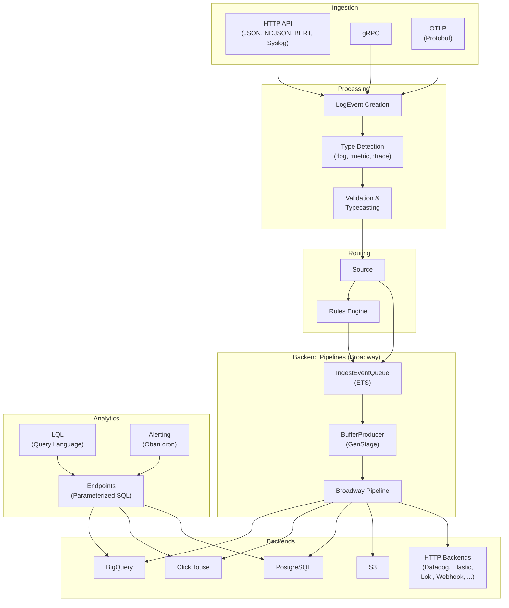

# Logflare Architecture

Logflare is a real-time log aggregation and analytics platform built with [Elixir](https://elixir-lang.org/)/[Phoenix](https://www.phoenixframework.org/). It ingests structured log events via HTTP, gRPC, and OpenTelemetry protocols, routes them through configurable pipelines, and stores them in pluggable backend databases. It supports both multi-tenant SaaS and single-tenant deployment modes.

## System Overview

## How to read these docs

- **[Ingestion](ingestion/index.md)** — how events arrive over HTTP, gRPC, and OTLP, and how the `LogEvent` struct is constructed and classified.
- **[Pipelines](pipelines/index.md)** — backend adaptors, Broadway pipelines, dynamic scaling, and the multi-layer backpressure model.
- **[Runtime](runtime/index.md)** — supervision tree, caching, and Rust NIFs.
- **[Query](query/index.md)** — endpoints, LQL, SQL parsing, and the alerting system.
- **[Operations](operations/index.md)** — web layer, deployment modes, and key dependencies.
