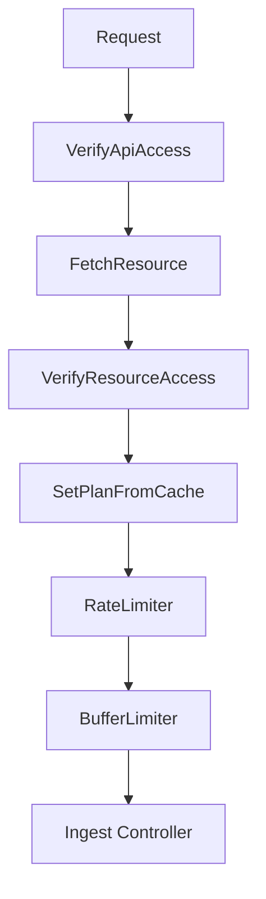

# Ingestion Layer

Logflare accepts log events through three protocol families, all funneling into the same internal `LogEvent` pipeline.

## HTTP API

The primary ingestion path. The Phoenix router defines an `:api` pipeline with parsers for multiple formats:

- **JSON** / **NDJSON** — standard structured log payloads
- **BERT** — Binary Erlang Term format for Erlang/Elixir clients
- **Syslog** — RFC 5424 syslog messages

OpenTelemetry Protobuf ingestion uses a separate `:otlp_api` pipeline (see [OpenTelemetry (OTLP)](#opentelemetry-otlp) below).

Ingestion requests pass through a plug pipeline that handles auth, rate limiting, and buffer limiting:

Rate limiting is per-source and plan-aware. Buffer limiting prevents queue overflow by rejecting requests when the `IngestEventQueue` is full.

## gRPC

A [gRPC](https://grpc.io/) endpoint runs alongside the HTTP server for high-throughput ingestion from clients that benefit from HTTP/2 streaming and binary serialization.

## OpenTelemetry (OTLP)

Dedicated OTLP endpoints accept [OpenTelemetry](https://opentelemetry.io/) protobuf payloads:

- `ExportTraceServiceRequest` — distributed traces
- `ExportMetricsServiceRequest` — metrics
- `ExportLogsServiceRequest` — logs

These are decoded and converted into `LogEvent` structs via modules in {{ src("lib/logflare/logs/") }}: {{ src("lib/logflare/logs/otel_log.ex") }}, {{ src("lib/logflare/logs/otel_metric.ex") }}, {{ src("lib/logflare/logs/otel_trace.ex") }}.
