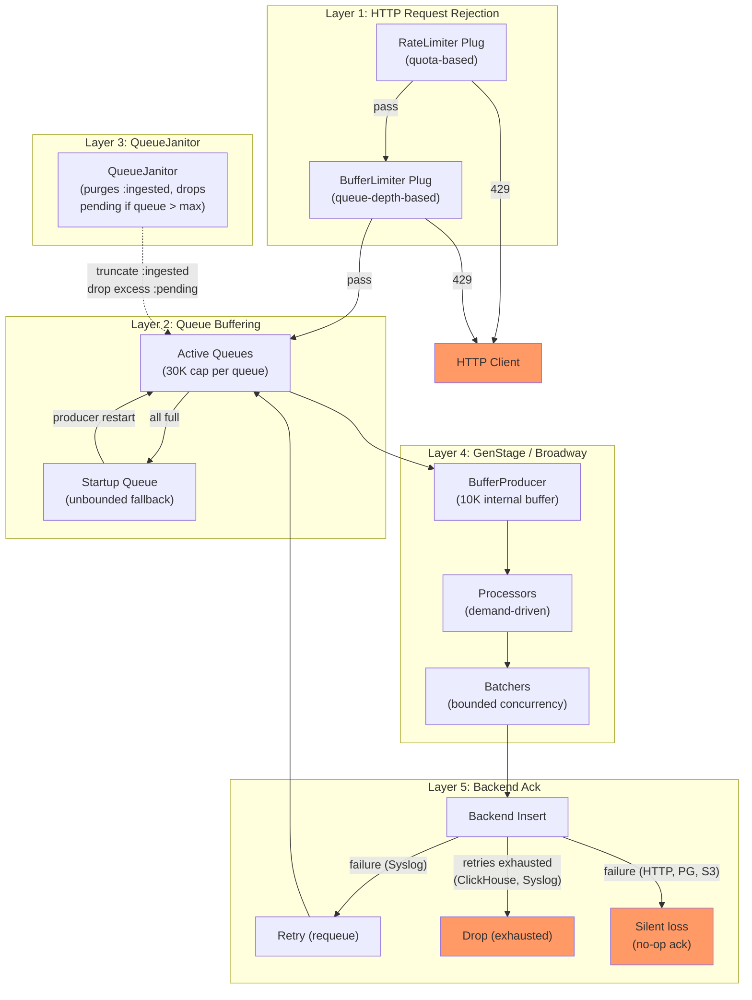

# Backpressure

Backpressure propagates across multiple layers, from backend storage back to HTTP clients. The system favors graceful degradation — absorbing and buffering aggressively before rejecting inbound requests.

## Layer 1: HTTP Request Rejection

Two plugs in the `:require_ingest_api_auth` pipeline gate requests before any queuing occurs:

**RateLimiter** ({{ src("lib/logflare_web/controllers/plugs/rate_limiter.ex") }}) — checks user-level and per-source API quotas derived from the billing plan via `Users.API.verify_api_rates_quotas/1`. Returns **HTTP 429** with `X-Rate-Limit` headers when quotas are exceeded. This is purely rate-based and independent of backend health.

**BufferLimiter** ({{ src("lib/logflare_web/controllers/plugs/buffer_limiter.ex") }}) — calls `Backends.cached_local_pending_buffer_full?/1`, which reads cached queue depths from `PubSubRates.Cache`. Returns **HTTP 429 "Buffer Full"** when the checked queues exceed 30,000 events (strict `>`, so exactly 30,000 is not considered full). This is the mechanism by which downstream congestion surfaces to clients.

The check follows two paths depending on source configuration:

- **Regular sources:** checks only the system default queue `{source_id, nil}`
- **Sources with `default_ingest_backend_enabled?`:** checks `{source_id, nil}` OR any user-configured default backend queues (`{source_id, backend_id}` for backends with `default_ingest?: true`). Returns full only when `{source_id, nil}` is full AND all user default backends are also full.

The buffer fullness check uses **total queue size** (both `:pending` and `:ingested` events), not just pending count. This means uncleaned `:ingested` events (from non-consolidated pipelines with no-op ack callbacks) contribute to the fullness threshold.

!!! warning "Limitation: consolidated backends are not checked"
    `BufferCacheWorker` iterates only `{source_id, backend_id}` tuples from the ETS mapper table — it never caches consolidated queue depths at all. The BufferLimiter therefore never sees consolidated queue depths (currently only ClickHouse). If the system default backend (queued at `{source_id, nil}`) is draining normally but the consolidated ClickHouse queue is overflowing, no 429 is returned.

## Layer 2: Queue Buffering (IngestEventQueue)

Once past the HTTP plugs, events enter `IngestEventQueue.add_to_table/3`. This layer **never rejects and never drops** — it always returns `:ok`. Instead, it applies smart distribution:

- Events are distributed round-robin across available per-producer **active queues**
- Queues at or above 30,000 events (`@max_queue_size`) are **skipped** — events are redirected to less-full queues
- If **all** active queues are full, events fall back to the **startup queue** (keyed with `nil` pid)
- No backpressure signal is sent upstream

!!! warning "The startup queue is unbounded"
    It has no size check on insertion. It is only drained when a `BufferProducer` starts (or restarts) and calls `IngestEventQueue.move/2` to transfer events to its active queue. If a producer is already running and healthy, nothing reads from the startup queue. In sustained overload where all active queues are full, the startup queue grows without limit.

For the standard (non-consolidated) path, two types of queues exist per `{source_id, backend_id}`:

| Queue Type | Key | Drained By | Size Limited? |
|-----------|-----|-----------|---------------|
| Active | `{source_id, backend_id, pid}` | `BufferProducer` polling | Yes (30K soft cap via `add_to_table` routing) |
| Startup | `{source_id, backend_id, nil}` | `BufferProducer` init (`move/2`) | No |

For the consolidated path (ClickHouse), the same pattern applies with `{:consolidated, backend_id, pid/nil}` keys.

## Layer 3: QueueJanitor

`IngestEventQueue.QueueJanitor` is a per-source-backend GenServer that performs periodic cleanup. It is started by `AdaptorSupervisor` for **non-consolidated pipelines only** — consolidated backends (ClickHouse) do not run a QueueJanitor.

**Two cleanup actions per queue:**

1. **Truncate `:ingested` events** — removes events that were fetched by `BufferProducer` (marked `:ingested` via `mark_ingested/2`) but whose ack callback did nothing. When source throughput is > 100 avg, all `:ingested` events are truncated; otherwise, a remainder of 100 is kept.

2. **Drop excess `:pending` events** — if total queue size exceeds `max` (default: `30,000 * 1.2 = 36,000`), drops 5% of `:pending` events and logs a warning. This is the hard safety valve against runaway queue growth.

**Startup queues are excluded** from the drop check (`pid != nil` guard at line 98), so the startup queue can grow past the max threshold without triggering drops.

The janitor interval scales with throughput: every 1s at high load (avg >= 2000), up to every 10s at low load (avg < 100).

| Config | Standard | Consolidated (if it ran) |
|--------|----------|------------------------|
| Max queue size | 36,000 | 360,000 (10x multiplier) |
| Purge ratio | 5% of `:pending` | 5% of `:pending` |
| Interval | 1–10s (adaptive) | 1–10s (adaptive) |

## Layer 4: GenStage Demand and Broadway Throttling

**BufferProducer** is a [GenStage](https://hexdocs.pm/gen_stage/) producer with an internal buffer of 10,000 events (configurable via `buffer_size` option). It only fetches from `IngestEventQueue` when downstream Broadway processors signal demand.

**Fetch modes differ by pipeline type:**

| Mode | Used By | Fetch | Cleanup |
|------|---------|-------|---------|
| Consolidated | ClickHouse | `pop_pending/2` — atomically removes events from ETS | Events gone immediately; ack handles failures |
| Per-source | HTTP, Postgres, S3, Syslog | `take_pending/2` + `mark_ingested/2` — leaves events in ETS as `:ingested` | QueueJanitor truncates `:ingested` events |

When demand stops (downstream saturated):

- The producer stops polling the queue
- If the internal 10K buffer fills before demand resumes, GenStage discards events via `format_discarded/2` (logged as a warning, throttled to once per 5 seconds)

!!! warning "First point of silent loss"
    GenStage buffer overflow is the first point where events are silently lost without client awareness — the HTTP 200 has already been returned, the queues have been bypassed, but the internal producer buffer overflows before downstream demand can drain it.

**Polling interval** scales with source throughput for non-consolidated producers (1s at high load, up to 5s at low load). Consolidated producers use a fixed interval.

Broadway pipelines apply further throttling through their configuration:

| Pipeline | Processor Concurrency | min_demand | Batch Size | Batch Timeout | Batcher Concurrency |
|----------|----------------------|------------|------------|---------------|-------------------|
| ClickHouse | 4 | 1 | 50,000 | 4s | 2 |
| HTTP-based | 3 | 1 | 250 | — | 6 |
| PostgreSQL | 5 | 1 | 350 | — | 5 |
| S3 | 5 | — | 10,000 (or 8MB) | configurable | 1 |

Low `min_demand` values mean processors pull conservatively from the producer, letting batchers accumulate events. Batcher concurrency caps how many backend writes happen in parallel. When all slots are busy, demand to the producer drops to zero, stalling the pipeline until capacity frees up.

## Layer 5: Backend Acknowledgment and Failure Handling

After Broadway processes a batch, the acknowledger determines what happens to events. Behavior varies significantly by adaptor:

**ClickHouse** (`@max_retries = 0`):

- Events were already removed from the queue by `pop_pending`
- On success: nothing to clean up — events are already gone
- On failure: **all failed events are dropped immediately** (logged as warning). Since `@max_retries = 0`, every failure is treated as exhaustion. Events are deleted from the queue (no-op since already popped) and permanently lost
- The `NativeIngester` layer below the pipeline has its own retry logic (1 retry with 500ms delay for connection/timeout errors), but pipeline-level ack sees only the final result

**Syslog** (`@max_retries = 1`):

- On failure (first attempt): events are deleted from queue and re-added as fresh `:pending` entries with `retries` incremented. This gives them one more chance through the pipeline
- On failure (second attempt): events are deleted and permanently dropped (logged as warning)

**HTTP-based, PostgreSQL, S3** (no-op ack):

- The `ack/3` callback is a no-op (`# TODO: re-queue failed`)
- On success: events remain in ETS with `:ingested` status. `QueueJanitor` eventually truncates them
- On failure: **events are silently lost**. They were marked `:ingested` before processing (in `BufferProducer.do_fetch/2`), the no-op ack doesn't revert them, and `QueueJanitor` cleans them up as if they succeeded. No retry occurs, no error is logged at the ack layer

| Adaptor | Failure Handling | Data Loss on Failure? |
|---------|-----------------|----------------------|
| ClickHouse | Explicit drop, logged | Yes (immediate, logged) |
| Syslog | 1 retry, then drop | Yes (after 1 retry, logged) |
| HTTP-based | No-op ack | Yes (silent, cleaned by QueueJanitor) |
| PostgreSQL | No-op ack | Yes (silent, cleaned by QueueJanitor) |
| S3 | No-op ack | Yes (silent, cleaned by QueueJanitor) |

## Pressure Cascade

When a backend slows down or becomes unavailable, pressure propagates upward through different paths depending on the pipeline type.

**Non-consolidated backends (HTTP, Postgres, S3, Syslog):**

1. Backend inserts slow → Broadway batcher/processor slots saturate
2. Broadway demand drops → BufferProducer stops polling IngestEventQueue
3. Active queue depths grow toward 30K (both `:pending` and uncleaned `:ingested` events count)
4. `BufferCacheWorker` (every 2.5s) caches queue depths → `PubSubRates.Cache`
5. BufferLimiter plug starts returning **429 Buffer Full**
6. QueueJanitor (every 1–10s) drops 5% of `:pending` if queue exceeds 36K

**Consolidated backends (ClickHouse):**

1. ClickHouse inserts slow → Broadway batcher/processor slots saturate
2. Broadway demand drops → BufferProducer stops polling
3. Active queue depths grow toward 30K per shard
4. **`DynamicPipeline` scales up** — Coordinator checks `list_pending_counts` every 10s, adds shards when any queue exceeds 5,000 (up to `System.schedulers_online()`)
5. If all shards at max and all active queues full → new events overflow to **startup queue** (unbounded)
6. **BufferLimiter does not trigger** for consolidated queues (cache key mismatch)
7. The only HTTP-level protection is `RateLimiter` (quota-based, independent of queue depth)

## Key Thresholds

| Constant | Value | Location | Purpose |
|----------|-------|----------|---------|
| `@max_queue_size` | 30,000 | {{ src("lib/logflare/backends/ingest_event_queue.ex", 17) }} | Per-queue routing cap in `add_to_table` |
| `@max_pending_buffer_len_per_queue` | 30,000 | {{ src("lib/logflare/backends.ex", 38) }} | BufferLimiter fullness threshold |
| QueueJanitor `max` | 36,000 | {{ src("lib/logflare/backends/ingest_event_queue/queue_janitor.ex", 24) }} | Hard drop threshold (30K * 1.2) |
| QueueJanitor consolidated `max` | 360,000 | {{ src("lib/logflare/backends/ingest_event_queue/queue_janitor.ex", 44) }} | 10x multiplier (not currently used) |
| `@scaling_threshold` | 5,000 | {{ src("lib/logflare/backends/adaptor/clickhouse_adaptor.ex", 36) }} | DynamicPipeline scale-up trigger |
| GenStage `buffer_size` | 10,000 | {{ src("lib/logflare/backends/buffer_producer.ex", 49) }} | Internal producer buffer before discard |
| `BufferCacheWorker` interval | 2,500ms | {{ src("lib/logflare/backends/ingest_event_queue/buffer_cache_worker.ex", 13) }} | How often queue depths are cached |
| `QueueJanitor` interval | 1,000–10,000ms | {{ src("lib/logflare/backends/ingest_event_queue/queue_janitor.ex", 21) }} | Adaptive cleanup frequency |

## Design Trade-offs and Known Gaps

- **No end-to-end acknowledgment** — once a client receives HTTP 200, the event may still be lost at GenStage overflow, backend exhaustion, or via no-op ack cleanup. Clients are not notified of post-acceptance data loss.
- **Consolidated queues bypass BufferLimiter** — `BufferCacheWorker` only iterates `{source_id, backend_id}` tuples from the ETS mapper table and never caches consolidated queue depths. This means ClickHouse queue overflow cannot trigger HTTP 429 responses. Only the rate-based `RateLimiter` provides HTTP-level protection for consolidated backends.
- **Startup queue is unbounded** — no component enforces a size limit on the startup queue. `QueueJanitor` explicitly skips it (`pid != nil` guard). In sustained overload where all active queues are full, the startup queue grows without limit, posing a memory exhaustion risk.
- **No QueueJanitor for consolidated backends** — the janitor is only started by `AdaptorSupervisor` (per-source pipelines). ClickHouse relies on `pop_pending` (atomic removal) for cleanup, but has no safety valve for excess `:pending` events if the pipeline can't keep up.
- **Silent data loss on failure (HTTP, Postgres, S3)** — the no-op ack callbacks mean failed events are treated identically to successful ones. `QueueJanitor` cleans them up as `:ingested` without logging the failure.
- **Local-node buffer checks** — `BufferLimiter` inspects only the local node's queue depths. In a cluster, total capacity before rejection is `30K x nodes x queues_per_node` for non-consolidated backends.
- **No circuit breaker** — the system has no mechanism to stop sending to a consistently failing backend. ClickHouse events are dropped on every failure; HTTP/Postgres events are silently lost. There is no exponential backoff, failure threshold, or open/half-open/closed state machine.

## Delivery Guarantees Summary

The system provides **at-most-once delivery** for all backends. Once a client receives HTTP 200, no further delivery guarantee exists.

| Backend | Retry on Failure? | Max Retries | Loss Mode |
|---------|-------------------|-------------|-----------|
| ClickHouse | No (`@max_retries = 0`) | 0 | Immediate drop, logged |
| Syslog | Yes (requeue) | 1 | Drop after retry, logged |
| HTTP-based (Datadog, Elastic, etc.) | No (no-op ack) | — | Silent; cleaned by QueueJanitor |
| PostgreSQL | No (no-op ack) | — | Silent; cleaned by QueueJanitor |
| S3 | No (no-op ack) | — | Silent; cleaned by QueueJanitor |
| BigQuery | No (no-op ack) | — | Silent; cleaned by QueueJanitor |

"Silent" loss means the pipeline marks events as `:ingested` but the ack callback is a no-op, so failed batches are never retried. `QueueJanitor` eventually truncates `:ingested` events regardless of whether they were successfully delivered.

Additional loss points that apply to all backends:

- **GenStage buffer overflow** — if the internal 10K buffer fills before downstream demand resumes, events are discarded (logged as warning)
- **QueueJanitor hard drop** — if queue size exceeds 36K (standard) or 360K (consolidated), 5% of `:pending` events are dropped
- **Startup queue growth** — unbounded, posing memory exhaustion risk under sustained overload
