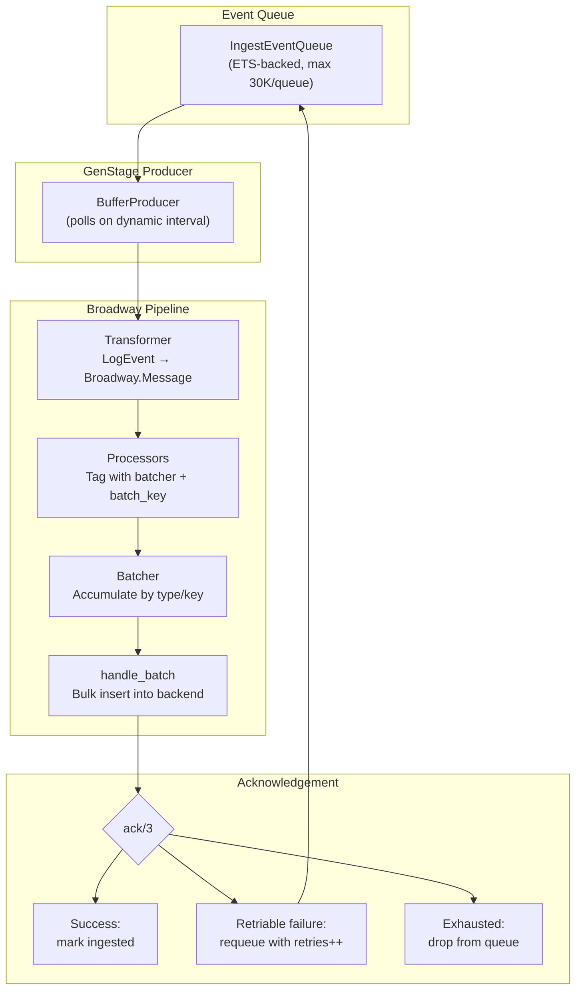
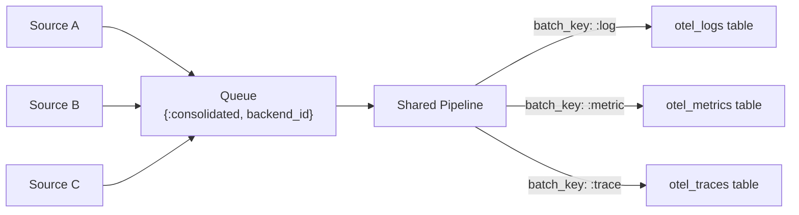
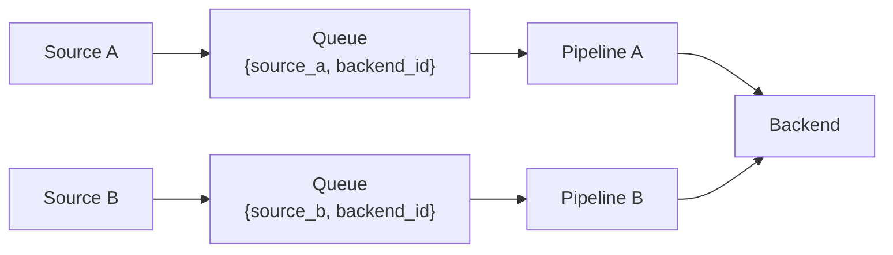

# Broadway Pipelines

[Broadway](https://hexdocs.pm/broadway/) is the core of the log ingestion pipeline, providing batching, back-pressure, and fault tolerance between the event queue and backend storage.

## Pipeline Implementations

| Pipeline | Adaptor | Batch Size | Processors | Batchers | Pattern |
|----------|---------|-----------|------------|----------|---------|
| `ClickHouseAdaptor.Pipeline` | ClickHouse | 50,000 | 4 | 2 | Consolidated |
| `BigQuery.Pipeline` | BigQuery | 500 (6MB cap) | adaptor-configured | adaptor-configured | Per-source (DynamicPipeline) |
| `HttpBased.Pipeline` | Datadog, Elastic, Webhook, etc. | 250 | 3 | 6 | Per-source |
| `PostgresAdaptor.Pipeline` | PostgreSQL | 350 | 5 | 5 | Per-source |
| `S3Adaptor.Pipeline` | S3 | Byte-based | 5 | 1 | Per-source |
| `SyslogAdaptor.Pipeline` | Syslog | 50 | 1 | 1 | Per-source |

## Data Flow Through Broadway

## IngestEventQueue

`Logflare.Backends.IngestEventQueue` is a GenServer managing ETS-backed buffers that sit between ingestion and Broadway:

- **ETS mapping table** — fan-out pattern directing events to per-queue tables
- **Per-queue tables** — one per `{source_id, backend_id, pid}` or `{:consolidated, backend_id, pid}`
- **Max queue size** — 30,000 events per queue
- **Event status tracking** — `:pending` | `:ingested`
- **Startup queues** — events land in a queue keyed with `nil` PID until a producer registers, then get moved to the active queue

## BufferProducer

`BufferProducer` is a [GenStage](https://hexdocs.pm/gen_stage/) producer bridging `IngestEventQueue` to Broadway:

- **Dynamic polling interval** — adjusts based on source ingestion metrics (up to 5x slower for low throughput)
- **Two fetch modes:**
  - `pop_pending` — consolidated mode, atomically removes events from queue
  - `take_pending` — standard mode, leaves events in place until acked

## Two Ingestion Patterns

### Consolidated Ingestion (ClickHouse)

All sources sharing a backend funnel through a **single pipeline**. Events are partitioned by `event_type` (`:log`, `:metric`, `:trace`) via `Broadway.Message.put_batch_key/2`, routing to type-specific OTEL tables.

Advantages: larger batch sizes (50K), fewer pipelines, better ClickHouse throughput via fewer larger inserts.

### Per-Source Ingestion (PostgreSQL, HTTP, S3)

Each source-backend pair gets its **own pipeline**, providing source-level isolation.

## Message Lifecycle

A typical Broadway message flows through:

1. **`transform/2`** — wraps `LogEvent` in a `Broadway.Message` with an acknowledger
2. **`handle_message/3`** — tags with batcher (e.g., `:ch`) and batch key (e.g., event type)
3. **`handle_batch/4`** — performs the bulk insert (mapping, serialization, network call)
4. **`ack/3`** — on failure, splits messages into retriable (retries < max → requeue) and exhausted (drop)
