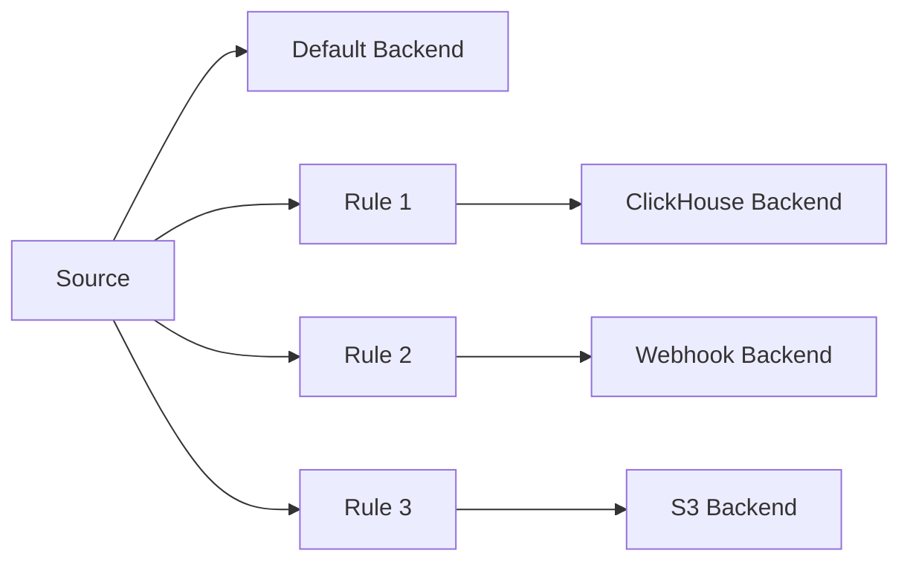
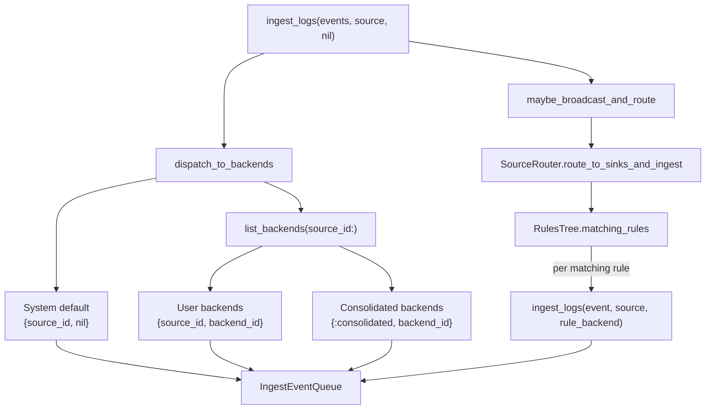

# Backend System

Backends are pluggable storage destinations implemented as adaptors. The {{ mod("Logflare.Backends.Adaptor") }} behaviour defines the interface.

## Adaptor Behaviour

**Required callbacks:**

| Callback | Purpose |
|----------|---------|
| `start_link/1` | Start the adaptor process |
| `cast_config/1` | Typecast configuration params |
| `validate_config/1` | Validate config via `Ecto.Changeset` |

**Optional callbacks (query execution):**

| Callback | Purpose |
|----------|---------|
| `execute_query/3` | Run queries against the backend |
| `transform_query/3` | Translate queries between SQL dialects |
| `ecto_to_sql/2` | Convert Ecto queries to backend-native SQL |
| `map_query_parameters/4` | Map parameters across dialects (e.g., BigQuery `@param` to PostgreSQL `$1`) |

**Optional callbacks (ingestion):**

| Callback | Purpose |
|----------|---------|
| `format_batch/1` | Transform batch before sending |
| `pre_ingest/3` | Preprocessing before queueing |
| `consolidated_ingest?/0` | Single pipeline per backend (all sources share batch) |
| `test_connection/1` | Connectivity check |
| `send_alert/3` | Send alert notifications |
| `transform_config/1` | Transform backend config before use |
| `supports_default_ingest?/0` | Whether backend participates in the default ingest path |
| `redact_config/1` | Redact sensitive config fields for display |

## Available Adaptors

| Adaptor | Type | Protocol | Notes |
|---------|------|----------|-------|
| **BigQuery** | Database | gRPC (Storage Write API) | Arrow IPC serialization via Rust NIF. The adaptor wraps the older per-source `Sources.Source.BigQuery.Pipeline` and `Schema` modules inside a `DynamicPipeline` supervisor |
| **ClickHouse** | Database | Native TCP / HTTP | LZ4 compression via Rust NIF; consolidated ingestion |
| **PostgreSQL** | Database | PostgreSQL wire protocol | Via [Postgrex](https://hexdocs.pm/postgrex/) |
| **Elasticsearch** | Search engine | HTTP | |
| **Datadog** | SaaS | HTTP | |
| **Loki** | Log store | HTTP | [Grafana Loki](https://grafana.com/oss/loki/) push API |
| **S3** | Object storage | HTTP | Byte-based batch splitting |
| **Axiom** | SaaS | HTTP | |
| **Webhook** | HTTP | HTTP | Generic outbound webhook |
| **Sentry** | Error tracking | HTTP | |
| **Incident.io** | Incident management | HTTP | |
| **Last9** | Observability | HTTP | |
| **Syslog** | Protocol | TCP/UDP | RFC 5424 |
| **OTLP** | Protocol | HTTP/Protobuf | OpenTelemetry export (gRPC not yet enabled) |

HTTP-based adaptors share a common pipeline implementation: {{ src("lib/logflare/backends/adaptor/http_based/pipeline.ex") }}.

## Routing via Rules

The {{ mod("Logflare.Rules") }} engine routes log events from a source to additional backends based on configurable criteria. Each rule associates a source with a backend — when an event matches, it's copied to the rule's destination backend.

## Routing Semantics

When `Backends.ingest_logs/3` is called (with `backend = nil` for standard ingestion), events are dispatched through three routing paths:

**1. System default** (`{source_id, nil}`) — every ingest always queues events to the nil-backend queue. This is consumed by the system default backend (BigQuery in SaaS, configurable in single-tenant via `LOGFLARE_SINGLE_TENANT_BACKEND_TYPE`).

**2. User-configured backends** (`{source_id, backend_id}`) — `Backends.Cache.list_backends(source_id:)` returns all backends associated with the source via the `sources_backends` join table. This includes backends with `default_ingest?: true`, which are automatically associated with all sources that have `default_ingest_backend_enabled?` set. Consolidated backends in this list use `{:consolidated, backend_id}` queue keys instead.

**3. Rule fan-out** — `SourceRouter.route_to_sinks_and_ingest/2` evaluates each event against the source's rules via `RulesTree`. For each matching rule with a `backend_id`, it calls `ingest_logs/3` with that specific backend. Rule-routed events get `via_rule_id` set to prevent re-evaluation.
