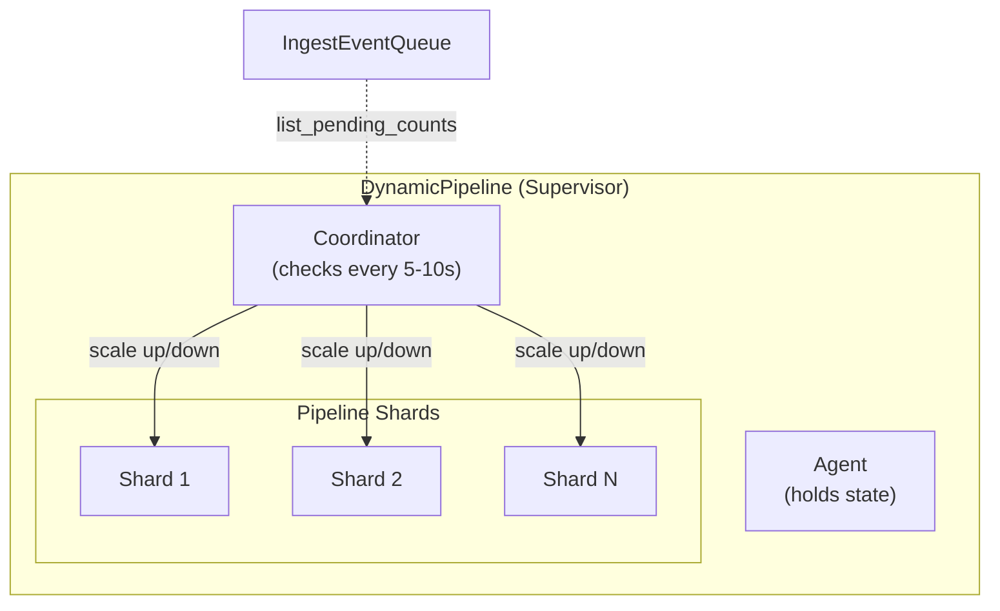

# Dynamic Pipeline Scaling

`Logflare.Backends.DynamicPipeline` dynamically scales Broadway pipeline **shards** based on queue depth.

The `Coordinator` periodically calls a `resolve_count` function that inspects `IngestEventQueue.list_pending_counts/1`. If queue depth exceeds thresholds, shards are added (up to `System.schedulers_online()`). If idle, shards are removed. Rate limiting prevents thrashing.

Currently used by the ClickHouse consolidated pipeline and the BigQuery adaptor.
