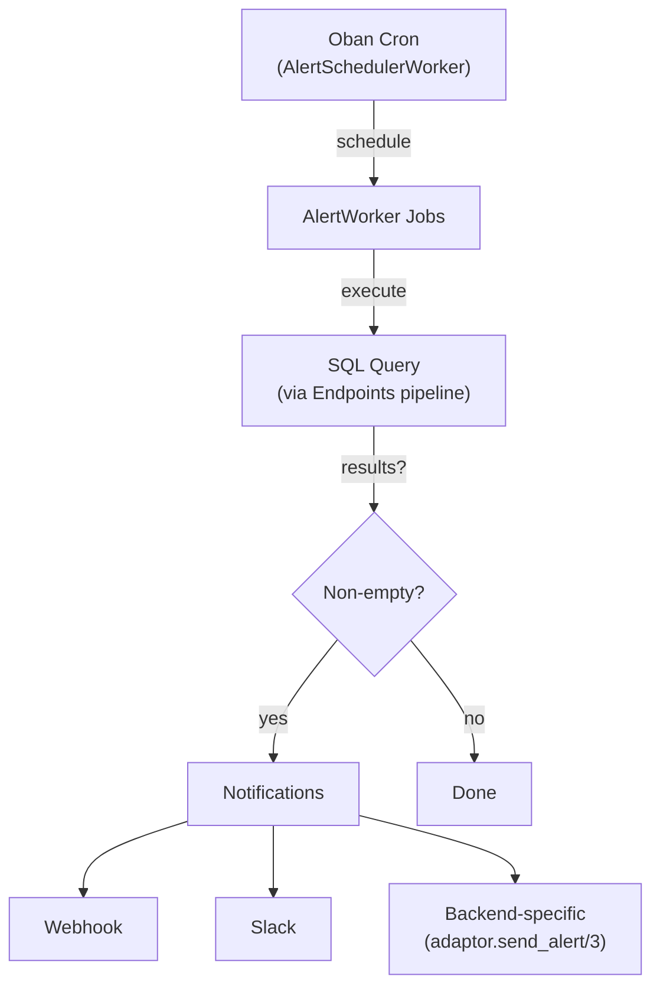

# Alerting

The alerting system executes SQL queries on a cron schedule and sends notifications when results are non-empty.

Alerts are managed via [Oban](https://hexdocs.pm/oban/) job queues:

- `schedule_alert/1` parses the cron expression, generates the next 5 run dates, and inserts Oban jobs
- `trigger_alert_now/1` allows immediate manual execution
- Execution history (last 50 runs) and future jobs are queryable
