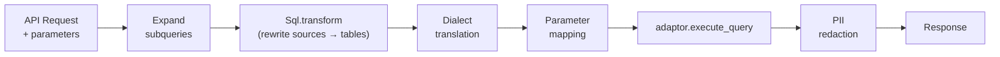

# Query and Analytics Layer

## Endpoints

`Logflare.Endpoints` provides parameterized SQL query endpoints for analytics. Each endpoint defines a SQL query template with named parameters that can be executed on demand.

**Query execution pipeline:**

Endpoints support:

- **Three SQL dialects:** BigQuery SQL, ClickHouse SQL, PostgreSQL SQL
- **Subquery expansion** — references to other endpoints or alerts are inlined as CTEs
- **Sandboxed queries** — endpoints can accept runtime LQL/SQL parameters, constrained to declared CTEs
- **Result caching** — configurable TTL via `ResultsCache`
- **Labels** — extracted from config, headers, and query params for downstream filtering

## LQL (Logflare Query Language)

LQL is a backend-agnostic query DSL parsed via [NimbleParsec](https://hexdocs.pm/nimble_parsec/). It compiles to dialect-specific SQL for each backend.

| LQL Dialect | Target Backend |
|-------------|---------------|
| `:bigquery` | BigQuery SQL |
| `:clickhouse` | ClickHouse SQL |
| `:postgres` | PostgreSQL SQL |

Core operations:

- `decode/2` — parse LQL string into rule structs (`FilterRule`, `SelectRule`, `FromRule`)
- `encode/1` — serialize rules back to LQL string
- `apply_rules/3` — apply rules to an `Ecto.Query`
- `to_sandboxed_sql/3` — compile to SQL for sandboxed endpoint execution

## SQL Parsing and Transformation

SQL parsing is handled by a Rust NIF (`sqlparser_ex`) wrapping the [`sqlparser`](https://crates.io/crates/sqlparser) crate. The Elixir interface in `Logflare.Sql` provides:

- **`transform/3`** — rewrite source names to physical table names, apply schema prefixes
- **`expand_subqueries/2`** — inline endpoint/alert references as CTEs
- **Dialect translation** — convert between BigQuery, ClickHouse, and PostgreSQL SQL variants
