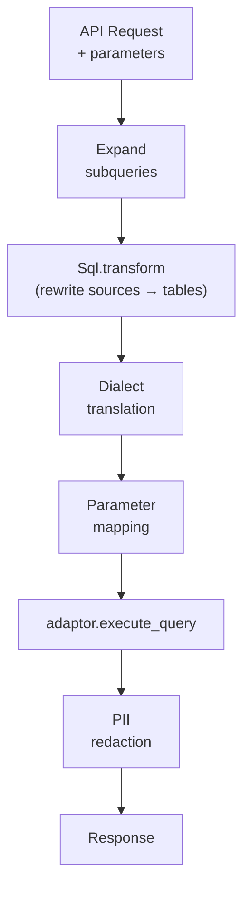

# Query and Analytics Layer

## Endpoints

{{ mod("Logflare.Endpoints") }} provides parameterized SQL query endpoints for analytics. Each endpoint defines a SQL query template with named parameters that can be executed on demand.

**Query execution pipeline:**

Endpoints support:

- **Three SQL dialects:** BigQuery SQL, ClickHouse SQL, PostgreSQL SQL
- **Subquery expansion** — references to other endpoints or alerts are inlined as CTEs
- **Sandboxed queries** — endpoints can accept runtime LQL/SQL parameters, constrained to declared CTEs
- **Result caching** — configurable TTL via `ResultsCache`
- **Labels** — extracted from config, headers, and query params for downstream filtering

## LQL and SQL

Two query languages feed the analytics layer:

- **[LQL](lql.md)** — Logflare's compact search-engine-style DSL (parsed via [NimbleParsec](https://hexdocs.pm/nimble_parsec/)). Used in the search UI, routing rules, and saved searches; compiles to dialect-specific SQL via per-backend transformers.
- **[SQL Parsing and Transformation](sql.md)** — every endpoint and alert SQL string is parsed (via the `sqlparser_ex` Rust NIF), validated, source-name-rewritten, and optionally subquery-expanded or sandboxed before reaching a backend.
