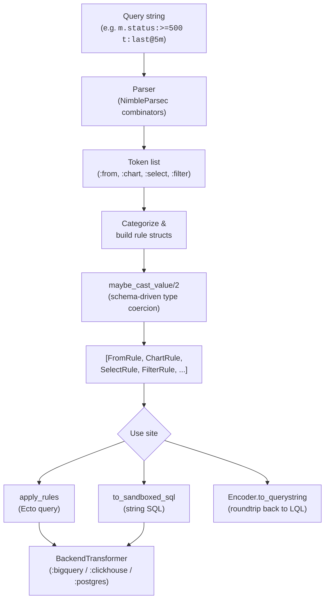

# LQL (Logflare Query Language)

LQL is a compact, search-engine-style query DSL that compiles to backend-specific SQL. It's the syntax behind the in-app log search bar, the rule engine, and saved searches, and it can also be embedded inside endpoints to constrain user input against a sandboxed CTE.

The parser is built on [NimbleParsec](https://hexdocs.pm/nimble_parsec/); the public API lives in {{ mod("Logflare.Lql") }}.

## Pipeline

## Public API

| Function | Purpose |
|----------|---------|
| `decode/2` | Parse LQL string against a schema; type-checks every field path |
| `decode!/2` | Same, raises on error |
| `encode/1` | Serialize a rule list back to a canonical LQL string |
| `apply_rules/3` | Apply filter + select rules to an `Ecto.Query` |
| `apply_filter_rules/3` | Filters only |
| `apply_select_rules/3` | Field projections only |
| `to_sandboxed_sql/3` | Compile LQL directly to a SQL string (used by sandboxed endpoints) |
| `language_to_dialect/1` | Map endpoint language atom (`:bq_sql`, `:ch_sql`, `:pg_sql`) to LQL dialect (`:bigquery`, `:clickhouse`, `:postgres`) |

## Rule Types

LQL produces a flat list of rule structs. Each clause type has its own struct:

| Struct | Clause | Example | Purpose |
|--------|--------|---------|---------|
| {{ mod("Logflare.Lql.Rules.FilterRule") }} | bare word, `m.field:value`, `t:...` | `m.status:>=500` | WHERE predicate |
| {{ mod("Logflare.Lql.Rules.ChartRule") }} | `c:agg(field) c:group_by(t::period)` | `c:p95(m.latency) c:group_by(t::minute)` | Time-series aggregation |
| {{ mod("Logflare.Lql.Rules.SelectRule") }} | `s:path` / `s:*` | `s:m.user.id` | Field projection |
| {{ mod("Logflare.Lql.Rules.FromRule") }} | `f:name` / `from:name` | `f:errors_cte` | Source/CTE selector (max one per query) |

Helper functions in {{ mod("Logflare.Lql.Rules") }} extract, normalize, and update rules of each type — `get_filter_rules/1`, `get_chart_rule/1`, `get_selected_fields/1`, `update_chart_rule/3`, `jump_timestamp/2` for paging through time, and so on.

## Filter Operators

The combinators in {{ mod("Logflare.Lql.Parser.Combinators") }} recognize:

| LQL | Atom | Meaning |
|-----|------|---------|
| `:` | `:=` | Exact match (default when no operator) |
| `:>` `:>=` `:<` `:<=` | `:>` etc. | Numeric / timestamp comparison |
| `:~` | `:"~"` | Regex match |
| `:@>` | `:list_includes` | Array contains value |
| `:@>~` | `:list_includes_regexp` | Array contains regex match |
| `lo..hi` | `:range` | Inclusive range (numeric, datetime, or `m.level:debug..error`) |
| `-` prefix | `negate: true` modifier | Negates the rule |
| `NULL` | `value: :NULL` | Null check |

`m.level:debug..error` is special-cased — the encoder collapses two-or-more level filters back into the range form using {{ src("lib/logflare/lql/parser/helpers.ex") }}'s severity ordering.

## Timestamp Shorthand

Timestamps accept both literal ISO-8601 ranges and shorthand forms resolved at parse time:

| Shorthand | Resolves to |
|-----------|-------------|
| `t:today` / `t:yesterday` | Calendar-day range |
| `t:this@hour` / `t:this@week` / `t:this@month` / `t:this@year` | Current period boundary |
| `t:last@5minute` / `t:last@1day` | Trailing window of `N period` |
| `t:>2024-01-01` | Open-ended comparison |
| `t:2024-01-{01..05}` | Date range using `{lo..hi}` brace expansion |
| `t:2024-01-01T10:{30..45}:00` | Datetime range with brace expansion on time components |

`FilterRule.shorthand` is preserved so the encoder can roundtrip back to the original form rather than expanded literals.

## Schema Validation

`decode/2` requires a schema (BigQuery `TableSchema` or a flat type map) and refuses unknown paths:

- Unknown path → `{:error, :field_not_found, suggested_querystring, message}` (the parser strips the bad clause and returns a suggested replacement string for UI hints).
- `:map`-typed field → rejected with "is not queryable" (only leaf fields can be filtered).
- Type-driven coercion: integer/float strings are parsed, `"true"`/`"false"` become booleans, datetime literals are parsed via {{ src("lib/logflare/lql/parser/helpers.ex") }}.

The parse-only variant `Parser.parse/1` (no schema) is used by callers that need rule shape without type checks — notably {{ mod("Logflare.Rules") }} routing rules and the sandboxed-SQL path.

## Backend Transformers

Once parsed, rules are applied to a query via a dialect-specific transformer. The behaviour {{ mod("Logflare.Lql.BackendTransformer") }} declares the contract:

| Callback | Responsibility |
|----------|----------------|
| `transform_filter_rule/2` | Single `FilterRule` → backend query fragment |
| `apply_filter_rules_to_query/3` | Fold many filters into an `Ecto.Query` |
| `transform_select_rule/2` / `apply_select_rules_to_query/3` | Field projection |
| `transform_chart_rule/5` | Aggregation + time-bucketing |
| `handle_nested_field_access/2` | Backend-specific handling for `m.foo.bar` paths (BigQuery uses `UNNEST`; PG/CH use JSON access) |
| `quote_style/0` | Identifier quoting (BigQuery `` ` ``, Postgres `"`, ClickHouse `nil`) |

Implementations:

| Dialect | Module | Nested-field strategy |
|---------|--------|-----------------------|
| `:bigquery` | {{ mod("Logflare.Lql.BackendTransformer.BigQuery") }} | `UNNEST` joins per nesting level; top-level fields like `event_message`, `timestamp`, `id`, `_PARTITIONDATE` bypass nesting |
| `:clickhouse` | {{ mod("Logflare.Lql.BackendTransformer.ClickHouse") }} | JSON path extraction on the OTEL columns |
| `:postgres` | {{ mod("Logflare.Lql.BackendTransformer.Postgres") }} | JSONB operators (`->`, `->>`, `@>`) |

## Encoder

{{ mod("Logflare.Lql.Encoder") }} produces a canonical LQL string from a rule list, used to populate the search bar URL and persist saved searches. It is intentionally not a verbatim mirror of input — it groups, sorts, and abbreviates:

- Group order: `from` → `select` → other filters → `chart`
- `metadata.x.y` collapses to `m.x.y`
- `timestamp:` collapses to `t:`
- Two-or-more `m.level:` filters collapse back into `m.level:lo..hi` range form
- Datetime values normalize to UTC and elide trailing zero microseconds

## Sandboxed SQL Compilation

{{ mod("Logflare.Lql.Sandboxed") }} compiles an LQL string directly to a SQL string, so endpoints can accept an LQL parameter and still run a single SQL statement against a sandboxed CTE. The flow:

1. Parse the LQL (no schema).
2. Pick the table name: a `FromRule` wins, otherwise the caller-supplied `cte_table_name`.
3. Build an Ecto query — either a `SELECT` (with explicit, wildcard, or filter-inferred field list) or a chart aggregation if a `ChartRule` is present.
4. Apply the filter rules through the dialect's `BackendTransformer`.
5. Render to SQL via the backend adaptor's `ecto_to_sql/2` (with `inline_params: true` so the SQL is self-contained inside the parent endpoint statement).

This is the bridge between LQL and the [SQL parsing](sql.md) layer: the resulting string is spliced into the endpoint's CTE-style "sandboxed" query and validated again by {{ mod("Logflare.Sql") }}.

## Validation Limits

{{ mod("Logflare.Lql.Validator") }} enforces semantic limits used by the search UI:

- At most one `ChartRule`
- Chart aggregations only on numeric paths (or `timestamp` for counts)
- Chart period must fit within the timestamp filter interval
- ≤ 250 chart ticks across the selected period
- ≤ 50 select rules
- Timestamp filters incompatible with live-tail mode
