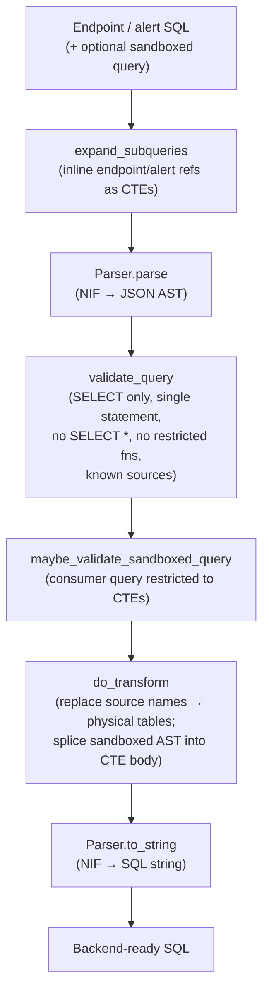
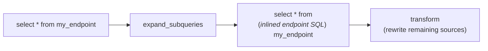
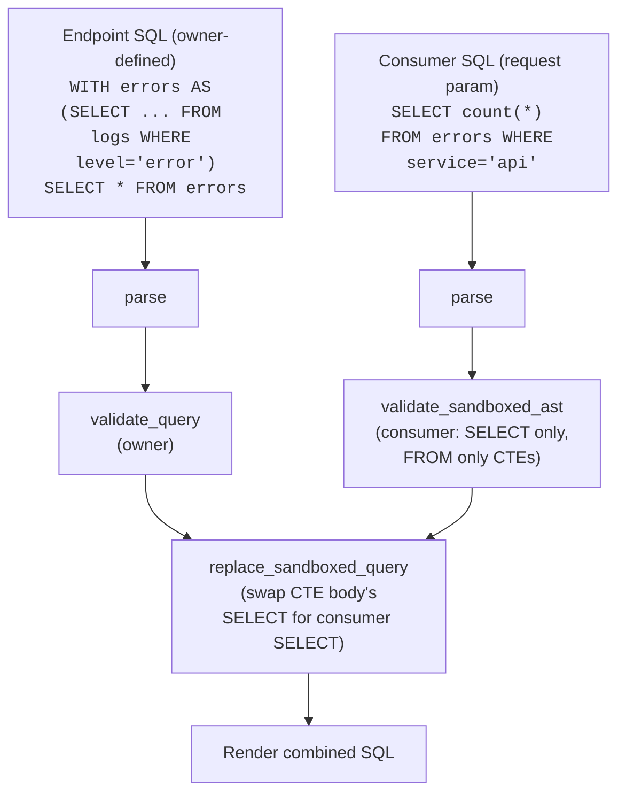

# SQL Parsing and Transformation

User-supplied SQL never reaches a backend untouched. {{ mod("Logflare.Sql") }} parses every endpoint and alert query into an AST, validates it, rewrites source names into physical table references, optionally inlines other endpoints/alerts as CTEs, and renders the result back to SQL. Sandboxed endpoints layer a second AST on top — a consumer query that's restricted to CTEs declared by the endpoint owner.

The parse/render itself is a thin Elixir wrapper ({{ mod("Logflare.Sql.Parser") }}) over a Rust NIF backed by the [`sqlparser`](https://crates.io/crates/sqlparser) crate (see [Rust NIFs](../runtime/rust-nifs.md)). Everything else — validation, source rewriting, dialect translation — operates on the JSON AST in Elixir.

## Pipeline

## Public API

| Function | Purpose |
|----------|---------|
| `transform/3` | Full pipeline: parse → validate → rewrite → render. Per-dialect head; `:ch_sql` and `:bq_sql` accept `{cte, consumer}` tuples for sandboxed queries |
| `expand_subqueries/3` | Inline references to other endpoints/alerts (matched by name) as CTEs in the input |
| `translate/4` | Cross-dialect translation — currently only `:bq_sql → :pg_sql` (see [Dialect Translation](#dialect-translation-bigquery-postgresql)) |
| `sources/3` | Return `%{source_name => token}` for every recognized source referenced in the query |
| `extract_table_names/2` | Raw qualified table names (no source filtering) |
| `parameters/2` | Names of all `@param` placeholders |
| `parameter_positions/2` | `%{1 => "param", 2 => "other", ...}` — used to map BigQuery `@name` to PG `$N` during translation |
| `contains_cte?/2` / `extract_cte_aliases/2` | CTE introspection |
| `source_mapping/4` | Rename source references (used when a source's name changes but the query still refers to the old name) |

Dialects map to language atoms via {{ mod("Logflare.Sql.DialectTransformer") }}: `:bq_sql ↔ "bigquery"`, `:ch_sql ↔ "clickhouse"`, `:pg_sql ↔ "postgres"`.

## Validation

`validate_query/2` runs in order; the first failure short-circuits:

| Check | Applies to | Failure |
|-------|------------|---------|
| `check_select_statement_only` | All dialects | `Insert`/`Update`/`Delete`/`Truncate`/`Merge`/`Drop`/`ShowVariable` rejected |
| `check_single_query_only` | All dialects | Multiple statements rejected |
| `maybe_check_restricted_functions` | BigQuery + ClickHouse | Calls or `FROM` references to dangerous functions blocked |
| `has_wildcard_in_select` | All dialects | `SELECT *` and `SELECT t.*` rejected — endpoints must enumerate columns |
| `check_all_sources_allowed` | All dialects | Every table reference must resolve to a known source, a CTE alias, or a fully-qualified BigQuery project name |

Restricted functions are listed in `@bq_restricted_functions` and `@ch_restricted_functions` at the top of {{ src("lib/logflare/sql.ex") }} — the ClickHouse list is large because it blocks every table function that can read from external systems (`s3`, `mysql`, `url`, `cluster`, `remote`, `sleep`, etc.).

For sandboxed queries, `maybe_validate_sandboxed_query_ast/2` runs the same validations against the consumer AST and additionally calls `has_restricted_sources/2` to ensure every `FROM` in the consumer query references a CTE alias from the parent (or a CTE the consumer itself declared).

## Source Name Rewriting

`do_replace_names/2` walks the AST replacing user-facing source names with physical table identifiers. The exact rewrite is dialect-specific:

| Dialect | Module | Rewrite |
|---------|--------|---------|
| BigQuery | {{ mod("Logflare.Sql.DialectTransformer.BigQuery") }} | `source_name` → `` `project.dataset.token` `` (BYOB BigQuery uses the user's project/dataset; otherwise Logflare's) |
| ClickHouse | {{ mod("Logflare.Sql.DialectTransformer.ClickHouse") }} | Pass-through (source name == ClickHouse table name) |
| PostgreSQL | {{ mod("Logflare.Sql.DialectTransformer.Postgres") }} | `source_name` → `"log_events_<token>"` via `PostgresAdaptor.table_name/1` |

The transformer's `quote_style/0` (`` ` `` for BigQuery, `"` for Postgres, `nil` for ClickHouse) is set on the rewritten identifier so the rendered SQL uses the dialect's native quoting.

`source_mapping/4` is a separate one-shot variant used when a source is renamed: it walks the AST swapping every occurrence of an old name for the current one (looked up by token), so saved endpoint SQL keeps working without manual edits.

## Subquery Expansion

`expand_subqueries/3` lets endpoint and alert SQL refer to *other* endpoints or alerts by name as if they were tables. Before transformation, `replace_names_with_subqueries/2` walks the AST: any `Table` whose name matches a query in the supplied list is rewritten as a `Derived` subquery with the referenced query's parsed body inlined.

Eligibility is filtered by language — `expand_subqueries(:bq_sql, ...)` only inlines queries whose `language` is also `:bq_sql`. Both [Endpoints](index.md) and [Alerting](alerting.md) call this before `transform/3`.

## Sandboxed Queries

BigQuery and ClickHouse endpoints can accept a consumer-supplied SQL parameter that runs *inside* a sandbox defined by the endpoint owner. The sandbox is expressed as a CTE-bearing query; the consumer query may only `FROM` those CTEs.

`do_replace_sandboxed_query/2` finds the outer query's `with` node and replaces the body of the parent `SELECT` with the consumer's body. The owner's `WITH` clause survives intact (or merges with the consumer's, if the consumer declared its own CTEs); the validators ensure the consumer can't escape into arbitrary tables.

PostgreSQL endpoints don't support sandboxed queries — `transform(:pg_sql, ...)` only accepts a raw string.

## AST Traversal Helpers

The AST is plain JSON-shaped Elixir maps and lists; transformations use two combinators in {{ mod("Logflare.Sql.AstUtils") }}:

| Helper | Use |
|--------|-----|
| `transform_recursive/3` | Visit every node; transform fn returns `{:recurse, node}` to continue or any other value to stop and replace |
| `collect_from_ast/2` | Walk the tree gathering items; collector returns `{:collect, item}` or `:skip` |

These are the basis for `find_all_source_names/1`, `extract_all_parameters/1`, the source/sandboxed-query replacers, and the dialect translator.

## Dialect Translation (BigQuery → PostgreSQL)

!!! warning "Slated for deprecation"
    `Sql.translate/4` and {{ mod("Logflare.Sql.DialectTranslation") }} are slated for removal — see [Legacy & Deprecated](../legacy.md#sql-dialect-translation-bigquery-postgresql). New PostgreSQL endpoints should be authored as PostgreSQL queries (`:pg_sql`) directly.

{{ mod("Logflare.Sql.DialectTranslation") }} translates BigQuery SQL to a Postgres-compatible form so the same endpoint SQL can run against either backend. It runs four passes over the AST plus a string-level cleanup:

| Pass | Purpose |
|------|---------|
| `bq_to_pg_convert_tables` | Flatten dotted BigQuery table names into single-segment Postgres identifiers |
| `bq_to_pg_convert_functions` | Map BQ functions (`regexp_contains` → `~`, `countif` → `count(*) FILTER`, `timestamp_sub` → `- INTERVAL`, `timestamp_trunc` → `date_trunc`, etc.) |
| `bq_to_pg_field_references` | Rewrite metadata field access into JSONB operators |
| `pg_traverse_final_pass` | Wrap numeric casts in `::TEXT` first to avoid JSONB-cast errors; flip `Arrow` (`->`) to `LongArrow` (`->>`) inside casts |
| String cleanup | Convert `@param` to `$N::text` using parameter-position mapping; rewrite `<schema>.<token>` table references with optional schema prefix; strip the `()` Postgres adds to `current_timestamp` |

The string-level rewrites at the end exist because a few cases are easier to express on the rendered SQL than on the AST — notably parameter renaming and the schema-prefix table substitution.

## Caller Map

The validation and rewrite pipeline is invoked from a small set of call sites:

| Caller | Function | Purpose |
|--------|----------|---------|
| {{ mod("Logflare.Endpoints") }} | `Sql.expand_subqueries`, `Sql.transform`, `Sql.parameters` | Compile every endpoint query before execution |
| {{ mod("Logflare.Alerting") }} | `Sql.expand_subqueries`, `Sql.transform` | Same flow, but executed directly against BigQuery on a cron schedule (see [Alerting](alerting.md)) |
| `LogflareWeb.Api.QueryController` | `Sql.transform` | Validate ad-hoc API queries |
| {{ mod("Logflare.Backends.Adaptor.PostgresAdaptor") }} | `Sql.translate` | Run BigQuery-style endpoint SQL against a PostgreSQL backend |
| `Endpoints.Query` changeset | `Sql.sources` | Detect referenced sources at save time for editor warnings |
