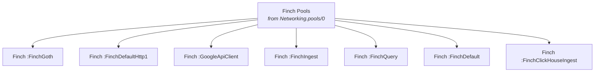
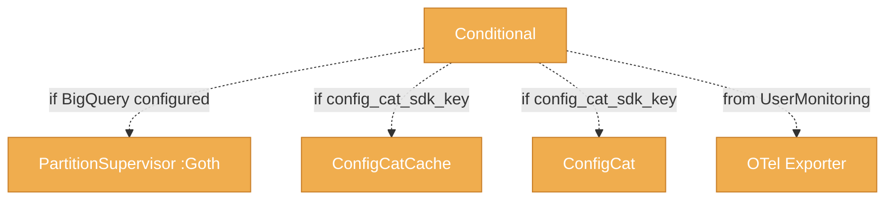
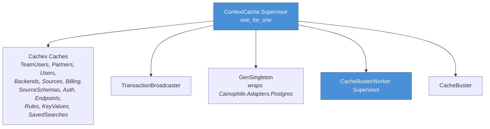
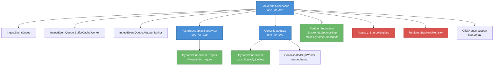
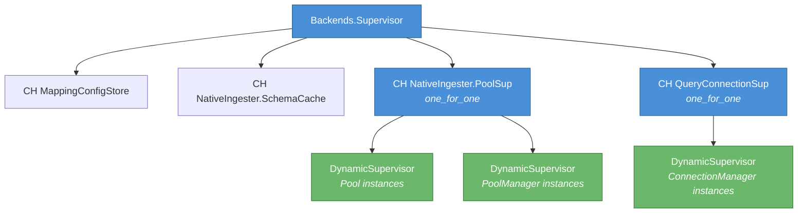
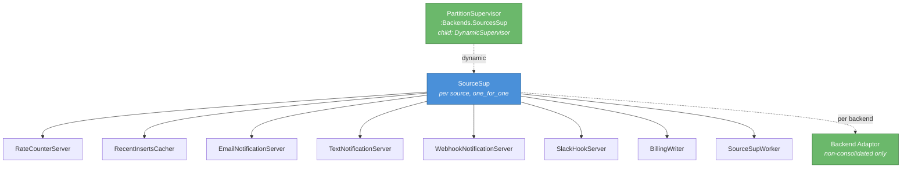
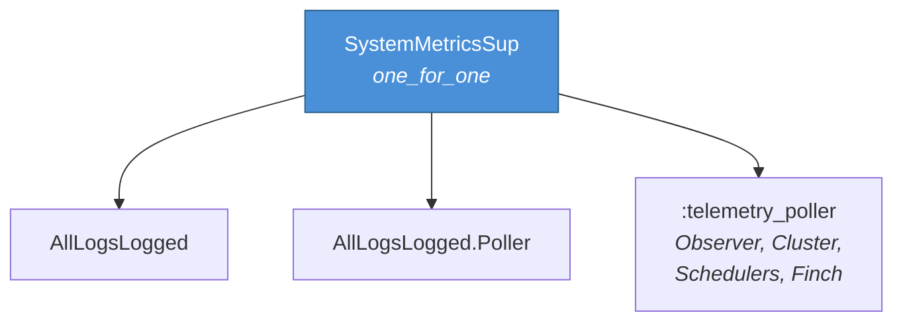

# Supervision Tree

The Logflare runtime is rooted at `Logflare.Supervisor` (`one_for_one`). Children are organised by responsibility — networking, conditional services, core infrastructure, caches, backends, web endpoints, and telemetry.

The supervision tree is large enough that a single diagram becomes illegible at content-area width. The diagrams below split the tree by branch, with the top-level overview as a map and each subsequent diagram zooming into one branch.

!!! note "Diagram color legend"
    All diagrams on this page use a consistent palette:

    - supervisor — `Supervisor` or `PartitionSupervisor`
    - dynamic — `DynamicSupervisor` or dynamically-started children
    - registry — `Registry` process
    - conditional — started only when configuration enables it

## Top-level overview

`Logflare.Supervisor` directly supervises 14+ children. The diagram below collapses each major branch to a single labeled node — see the per-branch diagrams further down for detail.

```mermaid
graph TD
    Root["Logflare.Supervisor<br/><i>one_for_one</i>"]

    Root --> Networking["Finch Pools<br/><i>networking/HTTP clients</i>"]
    Root --> Conditional["Conditional services<br/><i>Goth, ConfigCat, OTel exporter</i>"]
    Root --> Core["Core infrastructure<br/><i>Repo, Vault, Oban, PubSub,<br/>ErlSysMon, ClusterSup, TaskSups</i>"]
    Root --> CCSup["ContextCache.Supervisor"]
    Root --> CountersGrp["Counters &amp; rates<br/><i>Counters, RateCounters,<br/>PubSubRates, LogEventsCache,<br/>RejectedLogEvents</i>"]
    Root --> BackendsSup["Backends.Supervisor"]
    Root --> SourceSupervisor["Sources.Source.Supervisor<br/><i>per-source lifecycle GenServer</i>"]
    Root --> WebEndpoint["LogflareWeb.Endpoint"]
    Root --> GRPCSup["GRPC.Server.Supervisor"]
    Root --> SysMet["SystemMetricsSup"]
    Root --> Telemetry["Logflare.Telemetry"]
    Root --> EndpointsPSup["PartitionSupervisor<br/>:Endpoints.ResultsCache"]
    Root --> StartupTask["Task<br/><i>startup_tasks/0</i>"]
    Root --> ActiveUserTracker["ActiveUserTracker"]

    classDef supervisor fill:#4a90d9,stroke:#2c5f8a,color:#fff
    classDef dynamic fill:#6bb86b,stroke:#3d7a3d,color:#fff
    classDef conditional fill:#f0ad4e,stroke:#c77c25,color:#fff

    class Root,CCSup,BackendsSup,SysMet supervisor
    class EndpointsPSup dynamic
    class Conditional conditional
```

**Key ordering constraints:**

- `Repo` and `Vault` start before any child that touches the database
- `Backends.Supervisor` starts before `Sources.Source.Supervisor` (backends register queues that sources write to)
- `Counters` starts before `Sources.Source.Supervisor` (sources call counters during init)

## Networking — Finch pools

Seven named [Finch](https://hexdocs.pm/finch/) connection pools serve different traffic classes. They are listed by `Networking.pools/0` and started directly under the root.

## Conditional services

These are only started when their corresponding configuration is present.

## ContextCache supervisor

`ContextCache.Supervisor` (`one_for_one`) owns the read-through caches and the WAL-based cache invalidation pipeline. See [Caching](caching.md) for the read-through behaviour.

## Backends supervisor

`Backends.Supervisor` (`one_for_one`) owns ingestion-side infrastructure: the event queue, registries, the per-source partition supervisor, and adaptor-specific support processes. ClickHouse-specific connection management is split into a separate diagram below for legibility.

### ClickHouse-specific support processes

The ClickHouse adaptor adds connection pooling, schema caching, and mapping config storage as direct children of `Backends.Supervisor`.

## Per-source `SourceSup`

`SourceSup` is a `one_for_one` supervisor spawned dynamically for each active source under `PartitionSupervisor :Backends.SourcesSup`. It owns per-source workers (rate counters, notification servers, billing) and one adaptor child per backend (for non-consolidated backends; consolidated backends run under `ConsolidatedSup` instead).

The adaptor child itself starts an `AdaptorSupervisor` containing the backend's `QueueJanitor` and `Pipeline` (Broadway) — see [Broadway Pipelines](../pipelines/broadway.md) and [Backpressure → Layer 3](../pipelines/backpressure.md#layer-3-queuejanitor).

## System metrics

`SystemMetricsSup` (`one_for_one`) hosts the metric counters and pollers that surface telemetry to the rest of the system.

